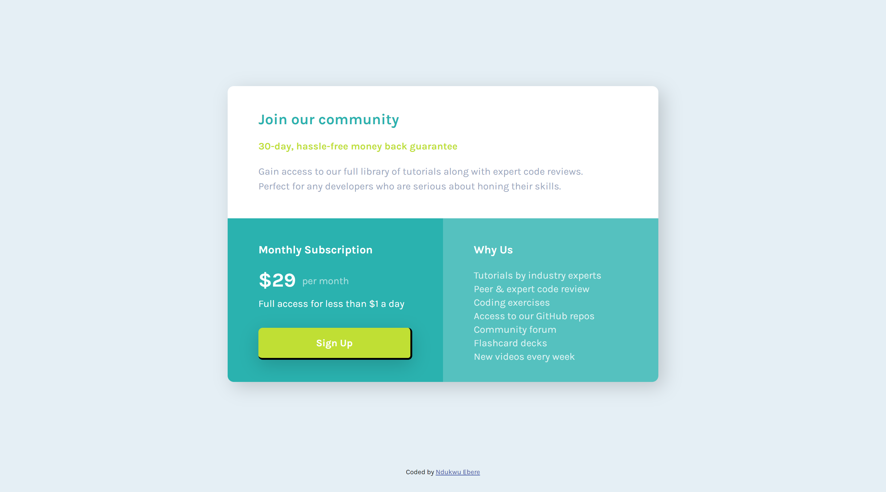

# Frontend Mentor - Single price grid component solution

This is a solution to the [Single price grid component challenge on Frontend Mentor](https://www.frontendmentor.io/challenges/single-price-grid-component-5ce41129d0ff452fec5abbbc).

## Table of contents

- [Overview](#overview)
  - [The challenge](#the-challenge)
  - [Screenshot](#screenshot)
  - [Links](#links)
- [My process](#my-process)
  - [Built with](#built-with)
  - [What I learnt](#what-i-learnt)
- [Author](#author)

## Overview

### The challenge

Users should be able to:

- View the optimal layout for the component depending on their device's screen size
- See a hover state on desktop for the Sign Up call-to-action

### Screenshot

### Links

- Live Site URL: [Live Site URL](https://your-live-site-url.com)

## My process

### Built with

- Semantic HTML5 markup
- CSS custom properties
- Flexbox
- CSS Grid

### What I learnt

I learnt nothing new in this challenge. It was just an application of my knowledge.

## Author

- Frontend Mentor - [@eby-coder](https://www.frontendmentor.io/profile/eby-coder)
- LinkedIn - [Ebere Ndukwu](https://www.linkedin.com/in/ebere-ndukwu-584722249/)
- Twitter - [@EPN](https://twitter.com/EPN39_5)
